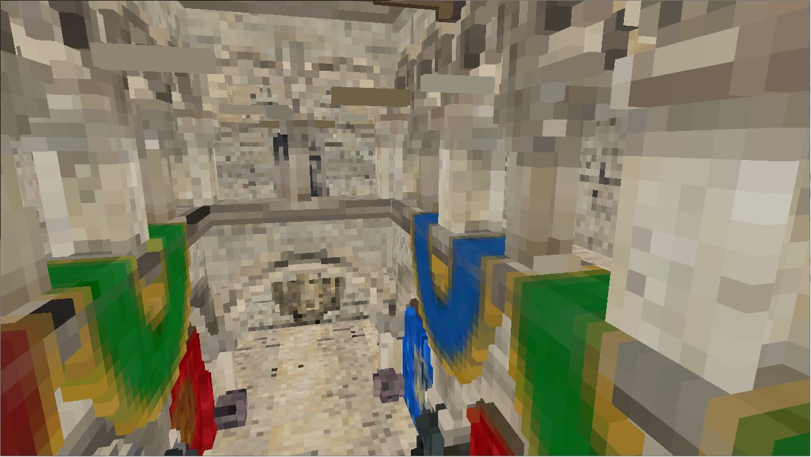
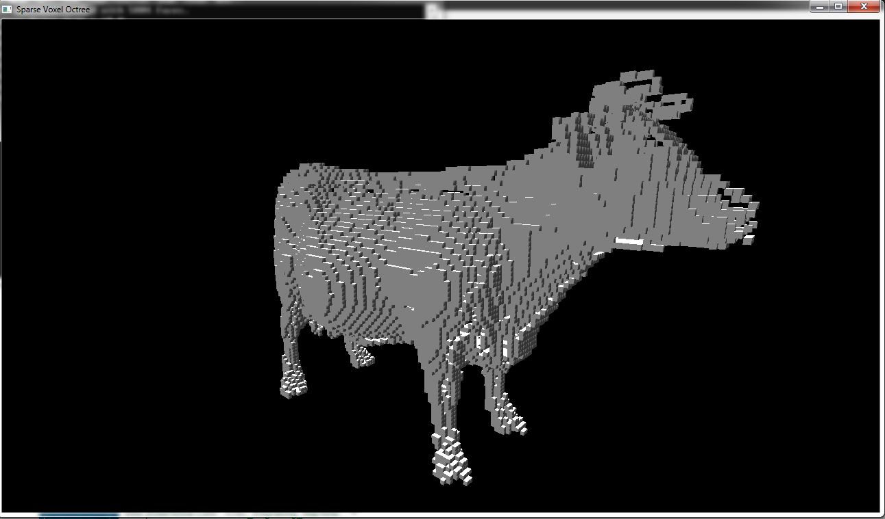
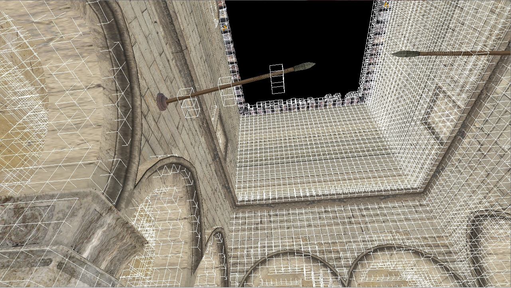
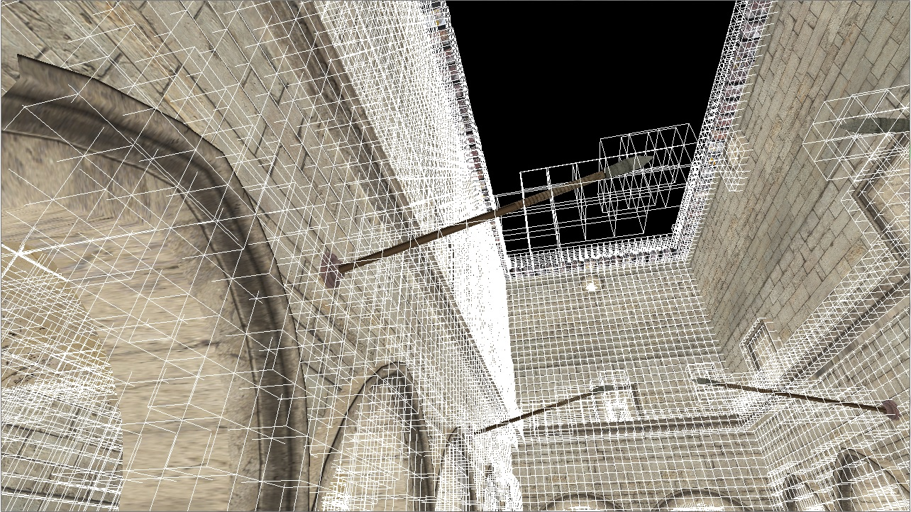

SparseVoxelOctree 
=================

Sparse Voxel Octree Implementation - Upenn CIS-565 final project

# Current Progress  
  
 
## Alpha presentation at UPenn CIS-565:
 * [slides](doc/alphademo.ppt)
 
## Final presentation at UPenn CIS-565:

## Scene Voxelization using GPU rasterization
 * Use the method described in [Ch. 22 of OpenGL Insight](http://www.seas.upenn.edu/~pcozzi/OpenGLInsights/OpenGLInsights-SparseVoxelization.pdf).
 * Each triangle is orthographically projected, in geometry shader, along the dominant axis of its plane normal vector.
 * In the framebuffer we will get something like this:
 
   
 * The whole scene can be voxelized in one single draw call.
 * In fragment shader, the geometry data is stored into a 3D texture, using GL_EXT_shader_image_load_store extension introduced in OpengGL 4.2.
 * Voxelized Geometry:  
 
   
 * Conservative Rasterization
   * While the hardware rasterization method is fast, it produces holes or cracks on voxelized thin surfaces. 
   The following image shows an exmaple:
   
    
  
  The flagpoles are not fully voxelized. This scenario occurs because naive rasterization won't generate fragments in pixel locations where pixel center is not 
  covered by primitives.  
  To mitigate this problem, this implementaiton uses a conservative rasterizaton method from [Hertel et al.](http://wwwcg.in.tum.de/research/research/publications/2009/a-hybrid-gpu-rendering-pipeline-for-alias-free-hard-shadows.html)  
  Simply put, the triangles are enlarged in clip space in geometry shader to ensure every pixel location covered by the triangles has fragment generated.  
  The following is the result of the conservative rasterization:  
    
  Now the flagpoles are fully voxelized.
  
## Sparse Voxel Octree (SVO) Construction  
  There are several methods available for constructing a SVO. This implementation uses the one described in [Ch. 22 of OpenGL Insight](http://www.seas.upenn.edu/~pcozzi/OpenGLInsights/OpenGLInsights-SparseVoxelization.pdf),
  with minor modification.  
  Several steps are needed for this SVO construction method: 
  
 * Build a voxel fragment list.
 * Build the SVO, level by level, using the voxel fragment list.
 * In each octree level:
  * tag nodes that need further division.
  * Allocate buffer spaces for next level.
  * Initialize the allocated buffer space.
 * After the octree structure is built. Inject the voxel atrributes (albedo, normal, etc.) into the leaf nodes, and average the values if multiple voxel fragments fall into the same leaf node.
 * Level by level, from bottom to top, mipmapping the node values into the interior nodes.
The above steps are performed using compute shaders. 
The following image shows a voxelized Crytek Sponza model with color shown:  
 
 
## Voxel Cone Tracing 
 * Still working on it.
 
## References:
 * Cyril Crassin and Simon Green. “Octree-based Sparse Voxelization Using the GPU Hardware Rasterizer.” OpenGL Insights, pp. 303-319.
 * Cyril Crassin, Fabrice Neyret, Miguel Sainz, Simon Green, and Elmar Eisemann. “Interactive indirect illumination using voxel cone tracing.” Pacific Graphics 2011.
 * Stefan Hertel, Kai Hormann, and Rudiger Westermann. A hybrid gpu rendering pipline for alias-free hard shadows. In Proceedings of Eurographics 2009 Area, 2009 

